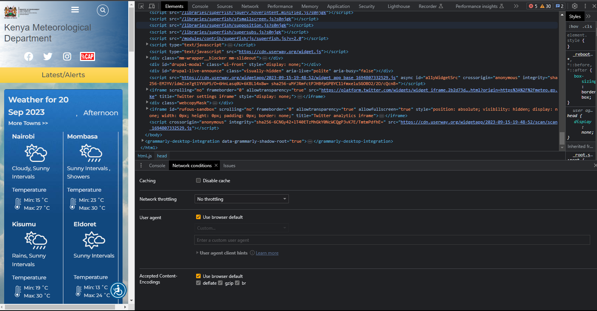
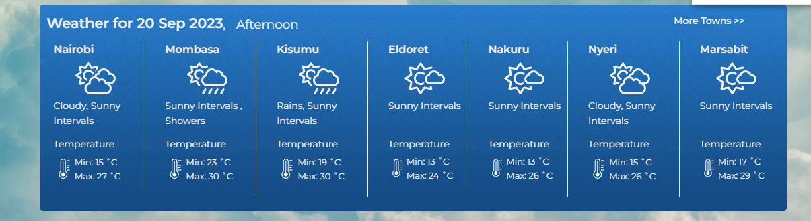
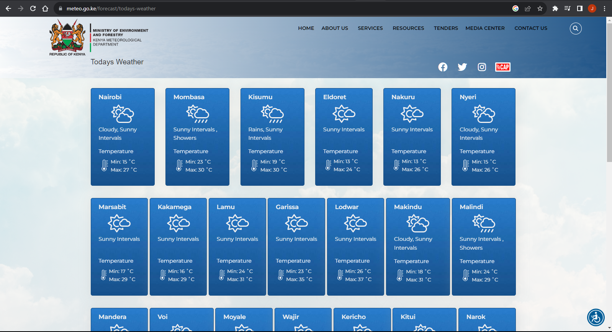
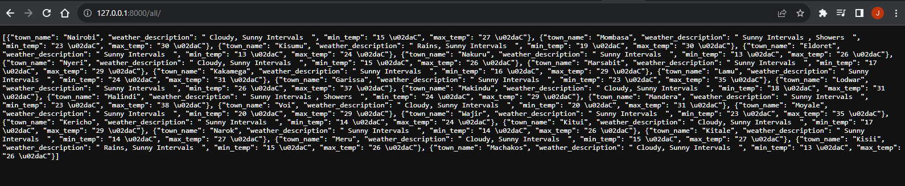

# Weather App

A weather app for minialists with deadlines!

## Description

This application consists of a **Django backend** and a **Flutter frontend**. The backend is a REST API that provides weather data for a given city. The frontend is a mobile application that displays the weather data.

There is no official weather API for Kenya Meteorological Department. The data used in this application is scraped from the [Kenya Meteorological Department](http://www.meteo.go.ke/) website.

## Installation / Setup

- Clone the repository
- Create a virtual environment and activate it

```bash
python3 -m venv venv
source venv/bin/activate
cd backend
pip install -r requirements.txt
python manage.py migrate
python manage.py runserver

```

## API Documentation

Let's assume the server is running on `localhost:8000`
The API has two endpoints:

- `/all/` - This endpoint returns all the weather data scraped from the Kenya Meteorological Department website.
- `/` - This endpoint returns the weather data for a given city. The city name is passed as a query parameter.

## Screenshots






## Todo

- Add weather forecast data
