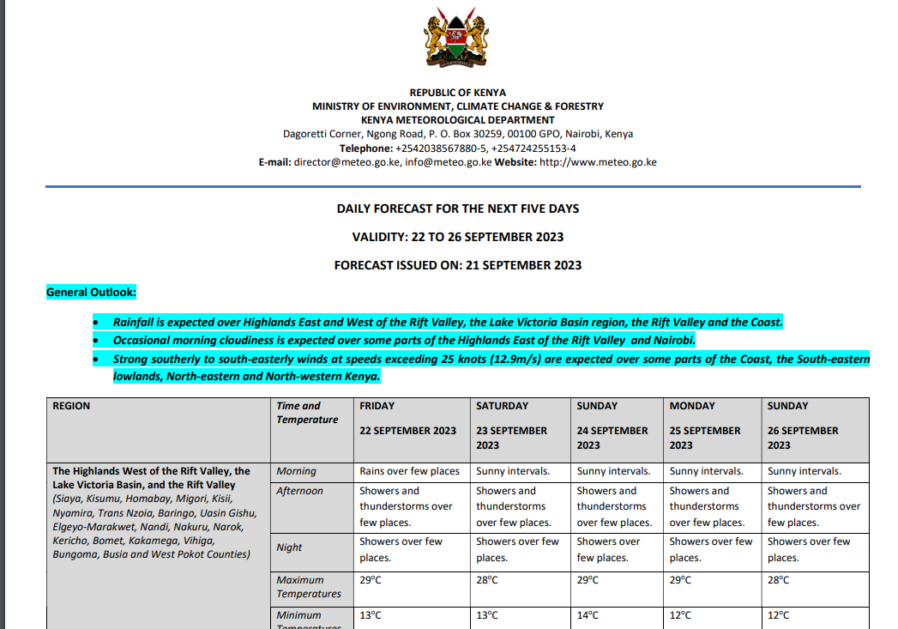
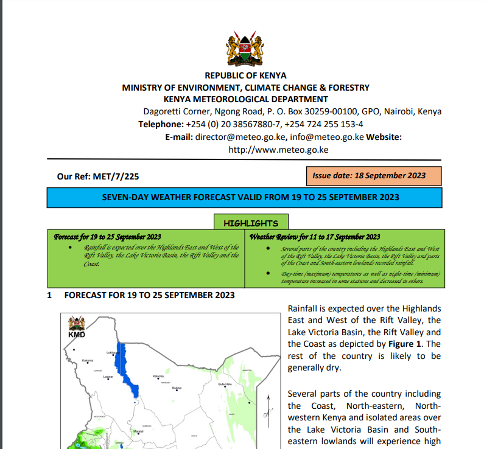
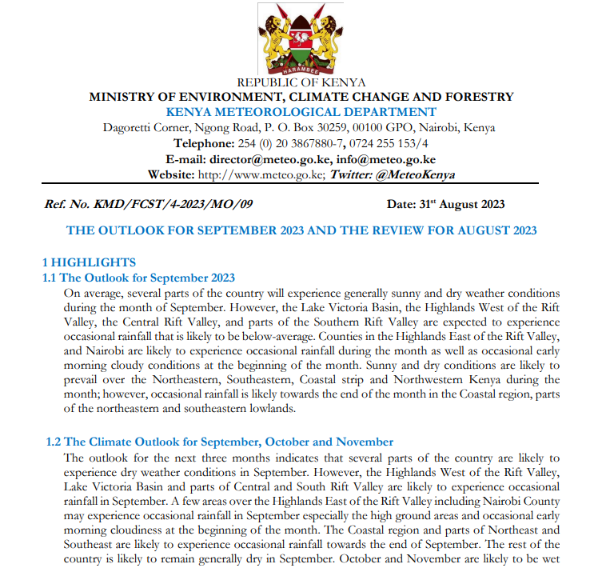

# Data Parsing

## Five Day Forecast

Parsing the data for the five day weather forecast is quite easy as the pdf is well structured. The data can be passed in tabular form using `tabula-py` and then converted to a pandas dataframe. The dataframe can then be converted to a dictionary. The dictionary is then passed to the database or return as a JSON response.
Screenshot of the pdf file:

## Seven Day Forecast

Parsing the data for the seven day weather forecast is a bit more difficult as the pdf is not structured in a tabular form. The pdf data can be parsed by using `langchain`, `vector stores` and an `LLM model` such as `ChatGPT` or `LLAMA2`. It is like **talking to your own data** where you ask the LLM model related to the data and it will return the answer. The answer can then be passed to the database or return as a JSON response.
Screenshot of the pdf file:

## Monthly Forecast

Parsing monthly forecasts can be achieved using the same technique as the one for 7 days forecast as the data is not also in tabular format
Screenshot of the pdf file:

